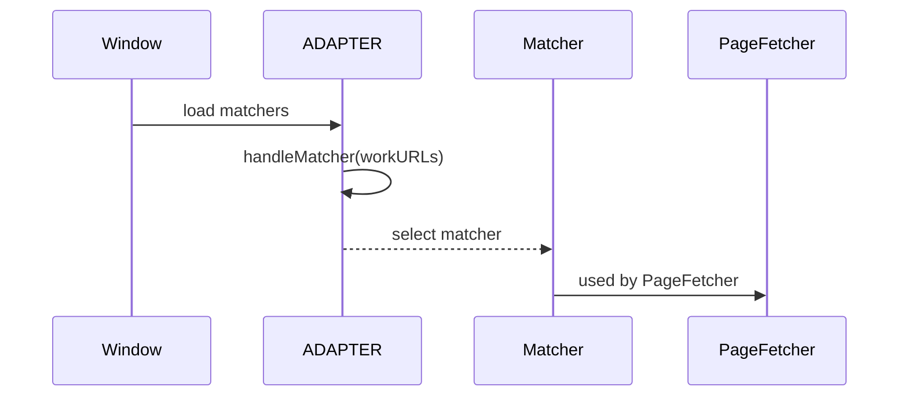
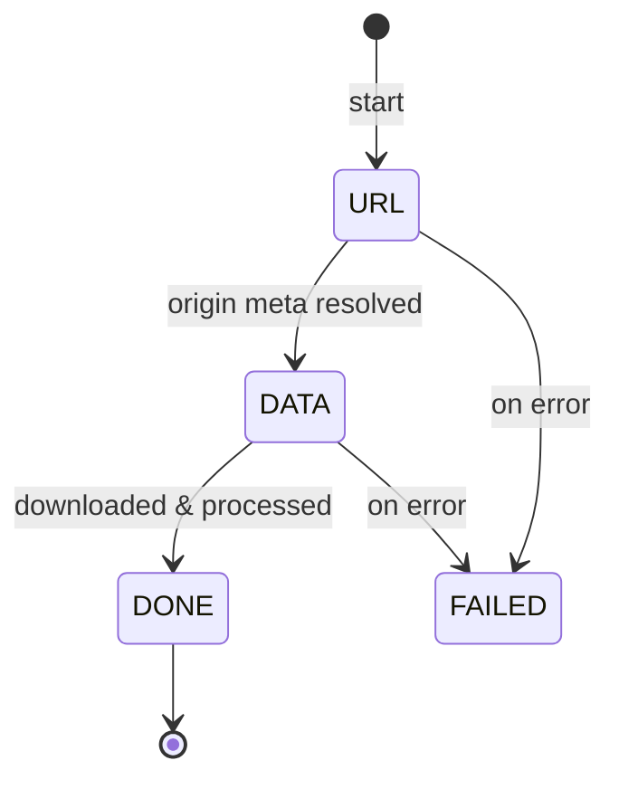

# Comic Looms Architecture Reference

This companion document explains the internal architecture of Comic Looms, focusing on the matcher lifecycle, page/image fetching pipeline, and the roles of key modules.

> [!NOTE]
> This document is intended to be supplementing the [CONTRIBUTING](CONTRIBUTING.md) document, please refer to it for guidance on contributing and adding new site support.

> [!TIP]
> For the complete project structure, please see [PROJECT_STRUCTURE.md](.assets/PROJECT_STRUCTURE.md). For a template file for creating new matchers, check out [template-example.ts](src/platform/matchers/template-example.ts).

## Table of Contents

- [Comic Looms Architecture Reference](#comic-looms-architecture-reference)
  - [Table of Contents](#table-of-contents)
  - [1. Architecture Overview](#1-architecture-overview)
  - [2. Matcher Lifecycle](#2-matcher-lifecycle)
    - [2.1. Registration](#21-registration)
    - [2.2. URL Matching](#22-url-matching)
    - [2.3. Matcher Interface and BaseMatcher](#23-matcher-interface-and-basematcher)
  - [3. Page and Image Fetching](#3-page-and-image-fetching)
    - [3.1. Practical Flow Example](#31-practical-flow-example)
    - [3.2. Function explanations (where to look in code)](#32-function-explanations-where-to-look-in-code)
    - [3.3. Image Fetcher state (detailed)](#33-image-fetcher-state-detailed)
    - [3.4. Chapter Management](#34-chapter-management)
    - [3.5. Lazy Page Loading](#35-lazy-page-loading)
  - [4. Image Fetching Flow](#4-image-fetching-flow)
    - [4.1. IMGFetcher State Machine](#41-imgfetcher-state-machine)
    - [4.2. Image URL Resolution](#42-image-url-resolution)
    - [4.3. Image Download and Processing](#43-image-download-and-processing)
  - [5. Queue and Concurrency](#5-queue-and-concurrency)
  - [6. UI Integration](#6-ui-integration)
  - [7. Event Bus](#7-event-bus)
    - [7.1. Event Bus (EBUS)](#71-event-bus-ebus)
  - [8. Download Architecture](#8-download-architecture)
  - [9. Common Code Paths](#9-common-code-paths)
    - [9.1. Simple page-based site](#91-simple-page-based-site)
    - [9.2. API-based site](#92-api-based-site)
  - [10. Recommended Files for Reference](#10-recommended-files-for-reference)

## 1. Architecture Overview

The userscript is built around three main layers:

1. Site detection and matcher selection.
2. Page source retrieval and image node parsing.
3. Image download, processing, rendering, and UI presentation.

The most important files are:

| Component                  | Key files                                                    | Representative functions                                                 |
| -------------------------- | ------------------------------------------------------------ | ------------------------------------------------------------------------ |
| Adapter / Matcher registry | `src/platform/adapt.ts`, `src/platform/matchers/*`           | `Adapter.addSetup()`, `Adapter.handleMatcher()`                          |
| Matcher base & interfaces  | `src/platform/platform.ts`                                   | `BaseMatcher.fetchPagesSource()`, `parseImgNodes()`, `fetchOriginMeta()` |
| Page orchestration         | `src/page-fetcher.ts`                                        | `PageFetcher.init()`, `appendNewChapters_()`, `appendNextPage()`         |
| Image fetcher              | `src/img-fetcher.ts`                                         | `IMGFetcher.start()`, `fetchImage()`, `fetchOriginMeta()`                |
| Queue & concurrency        | `src/fetcher-queue.ts`                                       | `IMGFetcherQueue.push()`, concurrency control                            |
| Download & archive         | `src/download/downloader.ts`, `src/download/gallery-meta.ts` | ZIP packaging, `zip-stream` usage                                        |
| UI                         | `src/ui/`                                                    | `full-view-grid-manager`, `big-image-frame-manager`                      |

Additions below include sequence diagrams and function-level descriptions for key flows.

## 2. Matcher Lifecycle

### 2.1. Registration

Each matcher registers itself in `src/platform/matchers/` by calling `ADAPTER.addSetup()`.

A matcher setup contains:

- `name`
- `workURLs`
- optional `match`
- `constructor`

### 2.2. URL Matching

`src/platform/adapt.ts` performs URL matching:

- `Adapter.addSetup()` stores matcher metadata.
- `Adapter.handleMatcher()` checks each setup's `workURLs` against `window.location.href`.
- The first matching setup becomes `ADAPTER.matcher`.
- `ADAPTER.ready` resolves with the selected setup.

This is the first decision point of the script.



### 2.3. Matcher Interface and BaseMatcher

The internal matcher API is defined in `src/platform/platform.ts`.

**`Matcher<P>` core methods:**

- `fetchPagesSource(chapter: Chapter): AsyncGenerator<Result<P>>`
- `parseImgNodes(pageSource: P, chapterID?: number): Promise<ImageNode[]>`
- `fetchOriginMeta(node: ImageNode, retry: boolean, chapterID?: number): Promise<OriginMeta>`
- `fetchImageData(imf: IMGFetcher): Promise<[Blob, number]>`
- `galleryMeta(chapter: Chapter): Promise<GalleryMeta>`
- `title(chapters: Chapter[]): string`
- `processData(data: Uint8Array, contentType: string, node: ImageNode): Promise<[Uint8Array, string]>`
- `headers(node: ImageNode): Record<string, string>`
- `appendNewChapters(url: string, old: Chapter[]): Chapter[]`

These methods use a few shared types:

- `P` is the matcher’s generic page source type. It can be a DOM `Document`, plain text, JSON payload, or another site-specific structure.
- `PagesSource` is the normalized alias passed into `parseImgNodes()` and typically matches `P`.
- `ImageNode` is the normalized image metadata object. It should include properties like `href`, `thumbnailSrc`, `originSrc`, `title`, and any extra values required to resolve the large image.
- `OriginMeta` is the resolved original-image result, usually containing the final image URL and optional headers.
- `Result<T>` is the async success/failure wrapper used by `fetchPagesSource()` so the pipeline can continue if one page fetch fails.

`BaseMatcher<P>` provides defaults for many matcher behaviors. This means a new matcher usually only needs to implement three methods:

- `fetchPagesSource()` to produce page sources or pagination items.
- `parseImgNodes()` to convert a page source into `ImageNode[]`.
- `fetchOriginMeta()` to resolve the actual image URL.

The base class also supplies working defaults for:

- `fetchImageData()` — standard blob download logic.
- `processData()` — pass-through image processing, overridable for decryption or reconstruction.
- `headers()` — request headers support for protected sites.
- `appendNewChapters()` — default chapter list behavior.
- `galleryMeta()` / `title()` — metadata helper behavior.

This design keeps matcher implementations focused on site-specific parsing and URL resolution while reusing shared download and queue behavior.

## 3. Page and Image Fetching

This section covers how page sources, image nodes, and image fetchers move through the runtime.

### 3.1. Practical Flow Example

This conceptual example shows how `PageFetcher` consumes matcher page sources and creates `IMGFetcher` instances. The exact implementation lives in `src/page-fetcher.ts`.

<details>
<summary>Example flow</summary>

```ts
// conceptual example; see src/page-fetcher.ts for the real implementation
async function consumeChapter(chapter, matcher, queue) {
	const iter = matcher.fetchPagesSource(chapter);

	while (true) {
		const res = await iter.next();
		if (res.done) break;
		if (res.value.error) continue;

		const nodes = await matcher.parseImgNodes(res.value.value || res.value.val);
		nodes.forEach((n, idx) =>
			queue.push(new IMGFetcher(idx, n, matcher, 0, chapter.id)),
		);
	}
}
```

</details>

### 3.2. Function explanations (where to look in code)

- `Adapter.handleMatcher(setup)` — see [`src/platform/adapt.ts`](src/platform/adapt.ts). It applies site overrides (from `getSiteConfig`) and resolves `ADAPTER.ready` when a match is found.
- `PageFetcher.init()` — see [`src/page-fetcher.ts`](src/page-fetcher.ts). It iterates `matcher.fetchChapters()` and sets up `Chapter.sourceIter`.
- `PageFetcher.appendNextPage()` / `appendPages()` — the methods that consume `Chapter.sourceIter.next()` and call `matcher.parseImgNodes()`; used to lazily grow the thumbnail queue.
- `IMGFetcher.fetchOriginMeta()` — thin wrapper that forwards to `matcher.fetchOriginMeta()` and updates `node.originSrc`.
- `IMGFetcher.fetchImageData()` — calls `matcher.fetchImageData(imf)`; the `BaseMatcher` implementation uses `xhrWapper()` to fetch blobs with timeout support.
- `BaseMatcher.processData()` — default pass-through; override to decrypt or reconstruct images (see `pixiv.ts`, `18comic.ts`).

### 3.3. Image Fetcher state (detailed)



### 3.4. Chapter Management

`PageFetcher` supports both single-chapter and multi-chapter sites.

- `matcher.fetchChapters()` may return a single default chapter.
- Sites with real chapters override this method.
- Each `Chapter` has a `sourceIter` created from `matcher.fetchPagesSource(chapter)`.

### 3.5. Lazy Page Loading

`Chapter.sourceIter` is consumed lazily by `PageFetcher.appendNextPage()`:

- Each `next()` call yields one page source.
- This reduces initial load and supports long galleries.
- The script continues loading more pages until enough images are queued.

## 4. Image Fetching Flow

### 4.1. IMGFetcher State Machine

`src/img-fetcher.ts` manages each image through stages:

- `FetchState.URL` – resolve the large image URL.
- `FetchState.DATA` – download image bytes.
- `FetchState.DONE` – create blob URL and render.

`IMGFetcher.start()` retries the full process up to three times.

### 4.2. Image URL Resolution

`IMGFetcher.fetchOriginMeta()` calls the matcher method:

- `matcher.fetchOriginMeta(node, retry, chapterID)`
- If `node.originSrc` exists, this call may return it directly.
- Otherwise, the matcher may request a detail page or API endpoint.

### 4.3. Image Download and Processing

`IMGFetcher.fetchImageData()` calls `matcher.fetchImageData(this)`.

`BaseMatcher.fetchImageData()` uses `xhrWapper()` for blob downloads and supports timeouts.

After download, `matcher.processData(data, contentType, node)` is invoked.

- Most matchers use the default pass-through behavior.
- Complex sites override this to decrypt or restore data.

## 5. Queue and Concurrency

`src/fetcher-queue.ts` manages how many images are loaded concurrently.

- The queue tracks active fetchers.
- It ensures image downloads adhere to configured thread counts.
- It also coordinates with the UI and idle loader.

## 6. UI Integration

`src/ui/` contains the presentation layer.

- `html.ts` establishes the Shadow DOM and root container.
- `full-view-grid-manager.ts` renders thumbnails.
- `big-image-frame-manager.ts` manages the large image viewer.
- `config-panel.ts` exposes user settings.

The UI responds to events from `EBUS` and user actions.

## 7. Event Bus

`src/event-bus.ts` is the central pub-sub bus that enables loose coupling between components.

### 7.1. Event Bus (EBUS)

The event system allows modules to publish and subscribe to named events.

**Event Types:**

```ts
interface EventBus {
	subscribe<T>(event: string, callback: (data: T) => void): void;
	unsubscribe(event: string, callback: Function): void;
	publish<T>(event: string, data: T): void;
	once<T>(event: string, callback: (data: T) => void): void;
}
```

**Example usage:**

```ts
// Subscribe to image append events
EBUS.subscribe("pf-on-appended", ({ nodes, chapterID }) => {
	console.log(`Added ${nodes.length} images from chapter ${chapterID}`);
	renderThumbnails(nodes);
});

// Publish download start
EBUS.publish("start-download", {
	chapters: selectedChapters,
	options: { zip: true, volumeSize: 1500 },
});

// One-time subscription
EBUS.once("download-finished", ({ path }) => {
	showNotification(`Download complete: ${path}`);
});
```

**Important events include:**

| Event                    | Publisher            | Subscribers         | Data                                                           | Description                           |
| ------------------------ | -------------------- | ------------------- | -------------------------------------------------------------- | ------------------------------------- |
| `pf-init`                | PageFetcher          | UI managers         | `{ chapters: Chapter[] }`                                      | PageFetcher initialized with chapters |
| `pf-change-chapter`      | PageFetcher          | UI, Queue           | `{ chapter: Chapter, index: number }`                          | Chapter changed                       |
| `pf-on-appended`         | PageFetcher          | FullViewGridManager | `{ nodes: ImageNode[], chapterID: number }`                    | New images appended                   |
| `pf-start-fetch`         | PageFetcher          | Queue               | `{ chapterID: number }`                                        | Starting to fetch a chapter           |
| `pf-fetch-error`         | PageFetcher          | UI                  | `{ error: Error, chapterID: number }`                          | Error fetching pages                  |
| `ifq-do`                 | IMGFetcherQueue      | IMGFetcher          | `{ fetcher: IMGFetcher }`                                      | Process next fetcher                  |
| `ifq-on-finished-report` | IMGFetcherQueue      | UI                  | `{ finished: number, total: number }`                          | Queue progress report                 |
| `ifq-finished`           | IMGFetcherQueue      | UI                  | `{ chapterID: number }`                                        | Queue finished for chapter            |
| `imf-on-finished`        | IMGFetcher           | Queue, UI           | `{ node: ImageNode, fetcher: IMGFetcher }`                     | Image finished loading                |
| `imf-on-error`           | IMGFetcher           | UI                  | `{ node: ImageNode, error: Error }`                            | Image failed to load                  |
| `imf-resize`             | IMGFetcher           | UI                  | `{ node: ImageNode, width: number, height: number }`           | Image dimensions available            |
| `bifm-on-show`           | BigImageFrameManager | UI                  | `{ node: ImageNode }`                                          | Big image viewer shown                |
| `bifm-on-hidden`         | BigImageFrameManager | UI                  | `{ node: ImageNode }`                                          | Big image viewer hidden               |
| `bifm-on-nav`            | BigImageFrameManager | UI                  | `{ node: ImageNode, direction: 'next', 'prev' }`               | Viewer navigation                     |
| `start-download`         | UI                   | Downloader          | `{ chapters: Chapter[], options: DownloadOptions }`            | Download initiated                    |
| `download-progress`      | Downloader           | UI                  | `{ current: number, total: number, chapter: string }`          | Download progress                     |
| `download-finished`      | Downloader           | UI                  | `{ path: string, chapters: Chapter[] }`                        | Download complete                     |
| `download-error`         | Downloader           | UI                  | `{ error: Error, chapter?: Chapter }`                          | Download error                        |
| `toggle-main-view`       | UI                   | PageFetcher         | `{ visible: boolean }`                                         | Main view toggled                     |
| `config-changed`         | Config               | All                 | `{ config: Config }`                                           | Configuration changed                 |
| `keyboard-shortcut`      | event.ts             | All                 | `{ key: string, ctrl: boolean, shift: boolean, alt: boolean }` | Keyboard shortcut triggered           |

Components subscribe to these events to synchronize loading, rendering, and user interaction.

## 8. Download Architecture

`src/download/downloader.ts` handles archive creation and segmentation.

- `gallery-meta.ts` defines metadata stored with ZIPs.
- `src/utils/zip-stream.ts` implements streaming ZIP creation.
- Large archives are split at 1.5GB boundaries.

## 9. Common Code Paths

### 9.1. Simple page-based site

- `fetchPagesSource(document)`
- `parseImgNodes(Document)`
- `fetchOriginMeta(node)`

### 9.2. API-based site

- `fetchPagesSource()` returns parsed JSON.
- `parseImgNodes(JSON)` converts API records to `ImageNode[]`.
- `fetchOriginMeta(node)` resolves the original URL from detail or media data.

## 10. Recommended Files for Reference

- `src/platform/platform.ts`
- `src/platform/adapt.ts`
- `src/page-fetcher.ts`
- `src/img-fetcher.ts`
- `src/download/downloader.ts`
- `src/utils/zip-stream.ts`
- `src/platform/matchers/pixiv.ts`
- `src/platform/matchers/ehentai.ts`
- `src/platform/matchers/twitter.ts`
- `src/platform/matchers/18comic.ts`
